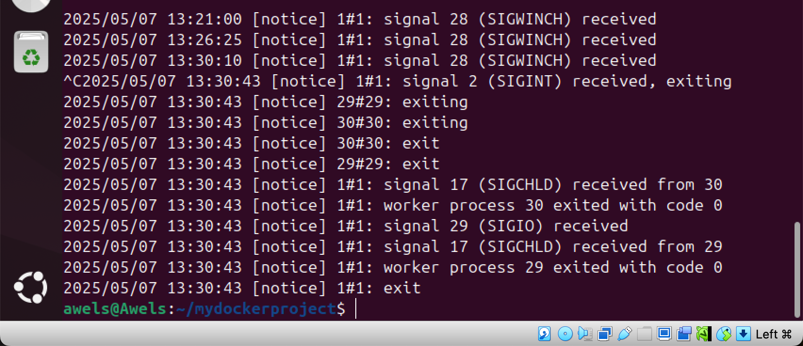

# MyDockerProject
this is the final project for docker

## PURPOSE OF THE PROJECT
1. to help me fully understand how docker works 
2. ensuring the web static page is acessible  on the specified port in the container. 

## PULLING IMAGES FROM DOCKER HUB
This is done by running the command "docker search ubuntu". This command allows you to discover and explore various images 
the result of running this command is below 

## DOWNLOAD THE OFFICIAL UBUNTU IMAGES
This is done by running the command "docker pull ubuntu"
the image below depicts this. 

## HOW TO VIEW THE LIST OF IMAGES THAT HAS BEEN DOWNLOADED AND ARE AVAILABLE ON MY LOCAL MACHINE

This is done by running the command "docker images". The image below depicts this. 

## CREATING A DOCKER FILE 
This was done by using an NGINX. i had to first create a docker file on my terminal using te command "mkdir Dockerfile" and then opening it on a text editor like nano or vim or vs code and then creating an index.html file. 

on the dockerfile write the following commAND of ehich i have done. The command is 

## Use the official NGINX base image
FROM nginx:latest

## Set the working directory in the container
WORKDIR  /usr/share/nginx/html/

## Copy the local HTML file to the NGINX default public directory
COPY index.html /usr/share/nginx/html/

## Expose port 80 to allow external access
EXPOSE 80

## No need for CMD as NGINX image comes with a default CMD to start the server

the image below depicts this 

i also had to impute this command into the index.html file that i created 'echo "welcome to darey.io"

after saving it i went forward to build the image using the command "docker build -t  dockerfile . " anf the image below depict this. 

it was built successfully. 

The next thing is to run the docker file and this is done by running this coommamd "docker run -p and the name of the docker file. the image below depicts this

running the command above would create a container that listens on port 80 using the NGINX image i created earlier. so i need to create a new rule in security group of the EC2 Instance. 
the first ting to do is on my EC2 instance i would click on the security tab
and make the neccesary changes by editing the inbound rule to add new rules. This will allow for incoming traffic to instances associated with security group. 

after which i came to my terminal to run the following command
"docker ps -a"
"docker start CONTAINER-ID"

all these can be seen in the images below 

## PUSING DOCKER HUB IMAGES
I created a dockeer account and logged in after which i created a repository and then logged into my docker account through my command line interface on ubuntu. after i logged in, i went further to tag my docker image befor pushing it and ensure that docker image is properly tagged. i did this using the command "docker tag <your-image-name> <your-dockerhub-username>/<your-repository-name>:<tag>"

after this was done, i immediatly logged into my docker account on the CLI and then pushed the images to docker hub. 
After that was done i verified that images is in my dockerhub repository.

the images below depicts this. 

## SIDE HUSTLE TASK
## LAUNCH AN INSTANCE ABD CREATE A DOCKER FILE 
the first task is to launch and ubuntu instances. the image below depicts this.

 

after whichh i proceeded to do the rest of the task. 
I firsly launched my EC2 instances and after that, i connected it and proceeded to log into it. i had to run commands like "sudo apt get" "sudo apt install docker" "sudo systemcli enable docker" etc and the images below depicts this. after which i created my docker file and wrote out its contentancreated my index.html file and wrote out its  contents. i used the nginx image as the base. i went further to copy my web static page file (a html file ) to the appropraite location within the computer. I also exposed the port my web application runs on (eg. on 80). 

I built my docker image using the command "docker build -t" accompanied with the name i intended to give to my docker image and a full stop. i built the image using the docker file and then i rsn the contaiiner using the command "sudo run -d -p" and the name of the container i created. 

## VERIFY IN BROWSER
I opened a web brower to :http://public ip and then confirmed that my web aapplication is running smoothly. 

the images belown depicts these

                                        
                                        
## CONVCLUSION. 

I fully understand what Docker is all about. i understand how images are and how to run a containers. i was able to run this project as well as the side hustle.  I also used clear and concise name for my docker image and container. I also provided comments in my dockerfile to  explain each step for a a better understanding.                                                                                                                                                                                                                                                                                                                                                                                                                                                                                                                                                                                                                                                                                                                                                                                                                                                                                                                                                                                                                                                                                                                                                                                                                                                                                                                                                                                                                                                                                                                                                                                                                                                                                                                                                                                                                                                                                                                                                                                                                                                                                                                                                                                                                                                                                                                                                                                                                                                                                                                                                                                                                                                                                                                                                                                                                                                                                                                                                                                                                                                                                                                                                                                                                                                                                                                                                                                                                                                                                                                                                                                                                                                                                                                                                                                                                                                                                                                                                                                                                                                                                                                                                                                                                                                                                                                                                                                                                                                                                                                                                                                                                                                                                                                                                                                                                                                                                                                                                                                                                                                                                                                                                                                                                                                                                                                                                                                                                                                                                                                                                                                                                                                                                                                                                                                                                                                                                                                                                                                                                                                                                                                                                                                                                                                                                                                                                                                                                                                                                                                                                                                                                                                                                                                                                                                                                                                                                                                                                                                                                                                                                                                                                                                                                                                                                                                                                                                                                                                                                                                                                                                                                                                                                                                                                                         ]